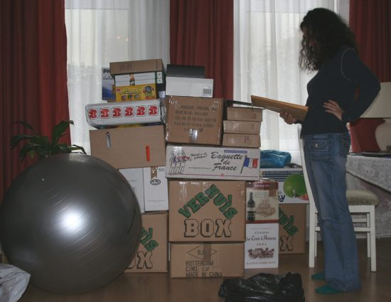

Nous avons trouvé un nouvel appartement, signature du bail le 30 mars. Juste à temps pour rendre les clefs de l'ancien appart le 31 mars.

  
Avant de partir, il faut faire le vide pour en avoir le moins possible à transporter,

  
Inventaire : *est ce que tout y est ?*

  
Premier voyage *Centrum* -> *Pijp*. Taz me montre le chemin sur le siège passager,

  
Petite pause entre deux voyages. Heureusement que c'est meublé avec la vaiselle.

  
Samedi soir : Il n'y a plus qu'à déballer.
