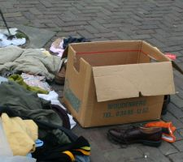
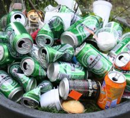
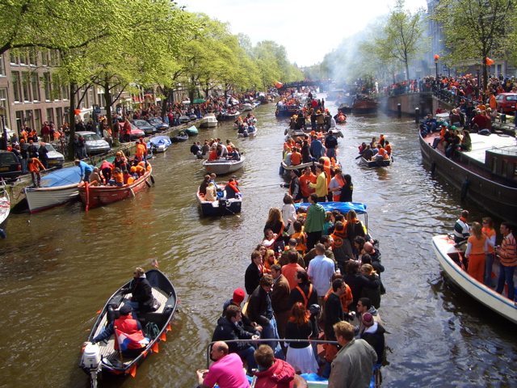

Évidement le lendemein, on est un peu fatigué mais je vous montrerais les photos un autre jour. Pour le moment, il faut récupérer...

{.left} {.left} 

*natures mortes de chez morte avec un truc orange en bas à droite*

<!--excerpt-->

Autres billets sur le sujet :
* [Koninginnedag](/koninginnedag)
* [Quelques panoramiques](/pas-de-fete-du-travail)
* [Ma collection de chapeaux](/hoeden)
* [Koningsdag : La fête du roi](/Premier-Koningsdag)

D'autres photos de notre sortie en bateau sont disponibles :  
* [sur le site de Pascale](http://www.xs4all.nl/~jlhkrans/Reine_2006/).
* [sur mon album en ligne](http://alix.guillard.fr/phototeque/view_album.php?set_albumName=konninginnedag-2006)

* Plus une photo avec notre bateau:

{# 
source: https://web.archive.org/web/20070328142220im_/http://harple.com/family/photos/netherlands/steve-in-nederland/steve-in-nederland-Images/30.jpg

[une photo avec notre bateau](http://harple.com/family/photos/netherlands/steve-in-nederland/steve-in-nederland-Pages/Image30.html) 
#}
