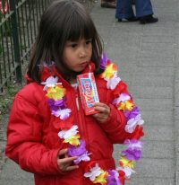
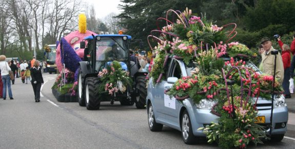
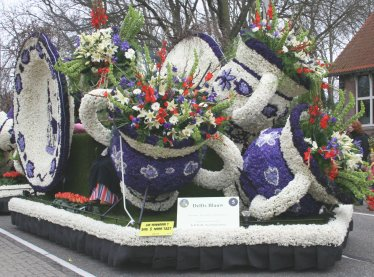

{.right}
Il y avait ce samedi un défilé de fleurs qui traversait la Hollande-du-Nord du sud au nord, soit de Noordwijk à Haarlem : le [bloemencorso](http://www.bloemencorso.info/). Un défilé de chars fleuris de 40 km. L'abondance de fleurs marque le printemps avec un thème précis. Cette année c'était *Meesterwerken*, je ne sais pas ce que ça veut dire, mais je peux dire que les chars étaient impressionnants tout comme les bouquets qui ornaient les voitures de luxe qui faisaient aussi partie du défilé.

Je vous livre quelques photos avant d'en mettre d'autres dans mon album.

Il y a en fait plusieurs bloemencorso dans ce pays mais celui que j'ai vu a [son propre site web](http://www.bloemencorso-bollenstreek.nl/).

* [Les autres photos sont en ligne](http://meinamsterdam.nl/jonge-bloemencorso)
* [Les trois visites «fleurs» du printemps](/les-fleurs-du-printemps)