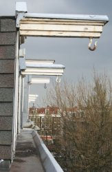
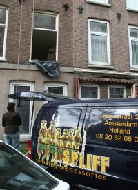
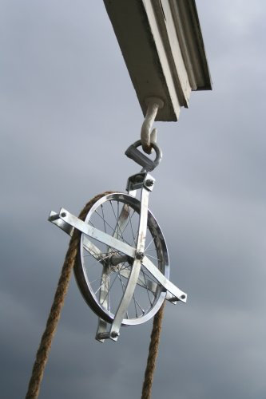
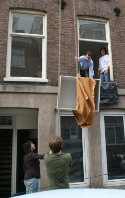

{.left}
Vous avez peut être remarqué les crochets qui surplombent les facades de la ville. Il y en a un qui est accessible de chez nous, depuis la fenêtre d'une chambre. Il a été très utile aujourd'hui.

Les voisins voulaient déménager aujourd'hui et quand on habite une maison Amstelodamoise, il est difficile de passer les meubles dans les escaliers. Ces derniers sont raides et étroits ce qui n'est pas pratique pour porter des meubles. Heureusement, les fenêtres sont larges et les façades sont équipés de crochets.

Les voisins du premier sont donc venu sonner pour demander à accrocher une poulie à notre crochet du 4e étage. En échange de leur permission, j'ai pu les prendre en photo et vous montrer ainsi comment se passe un déménagement traditionnel à Amsterdam.

{.center}  
comment charger le camion? c'est haut et les escaliers sont étroits.

{.center}  
pose de la poulie

((/public/images/photos/2006-04/déménagement-1.jpg))   
voilà ce qu'on appel passer un meuble par la fenêtre

voir aussi: [Les déménageurs futés](/les-demenageurs-futes)
---