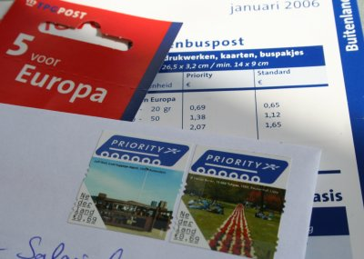

Les tarifs postaux bataves sont très pratiques, jugez par vous même :

{.center}

L'unité de compte des tarifs postaux est **le timbre**. Cela ne vous semble pas visible au premier abord mais voyez les tarifs postaux en ligne de TPG post (devenu [TNT Post](/la-poste-prends-les-couleurs-d-halloween) le lien ne fonctionne plus). On pourrait les traduire de la manière suivante :

* de **0 à 20g** = **un timbre**
* de **20g à 50g** = **deux timbres**
* de **50g à 100g** = **trois timbres**
* et ainsi de suite

Pour les pays bas (*Nederland*), le timbre est à 0,39€ pour l'union européenne (*Binnen Europa*) à 0,69€ et pour le reste du monde (*Buiten Europa*), il est à 0,85€. Bref, quand on achète un carnet de timbres pour une destination, on est paré pour affranchir au plus juste tout type d'envoi, de 5 grammes à 2 kilos. Il y a un coté pratique indéniable.

Bien sûr, on pourrait rétorquer que le tarif postal est élevé qu'en France, que l'on peut payer moins cher le même envoi en France et que pour affranchir au plus juste, il suffit d'acheter une vignette à un distributeur automatique. Cela est vrai mais tout le monde n'ayant pas un distributeur automatique dans son salon, il y a quand même un coté pratique qu'on ne saurait retirer à **TPG Post**. Une idée à exporter.
---
<!-- post notes:
http://www.tntpost.nl/voorthuis/brieven-en-kaarten/tarieven/
--->
