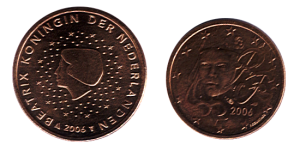

{.left} Pour ceux qui ne le savent pas encore, [je collectionne les euros](http://alix.guillard.free.fr/euros/) (les pièces uniquement, [les billets, je les enregistre](http://fr.eurobilltracker.eu/?referer=31378)).

Avant de mon dernier voyage [Paris](/week-end-de-paques-a-paris) -> Amsterdam, Je suis allé voir Franck [qui collectionne aussi les euros](http://f.villaume.free.fr/pieces.html). Ce soir là, il m'a donné sa première pièce millésimée 2006, c'était un 2 centimes français et j'étais très flatté. La semaine suivante, je trouvais dans ma monnaie, ma deuxième pièce millésimée 2006, un 5 eurocents néerlandais, j'étais très fier.

Aujourd'hui, je retrouve dans mon porte-monnaie, une nouvelle pièce *5 ¢ 2006 néerlandaise*. Inutile de vous dire que je vais la mettre de coté pour Franck.
---