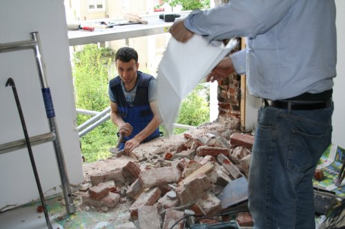

Le propriétaire nous avait prévenu : «Nous devrions être un peu dérangé pendant 2 jours au mois de mai parce que les fenêtres allaient être changées.»

Je vous laisse une photo de la cuisine au troisième jour des travaux pour que vous vous rendiez compte que nous ne sommes pas trop dérangés.

c'était hier :  

---