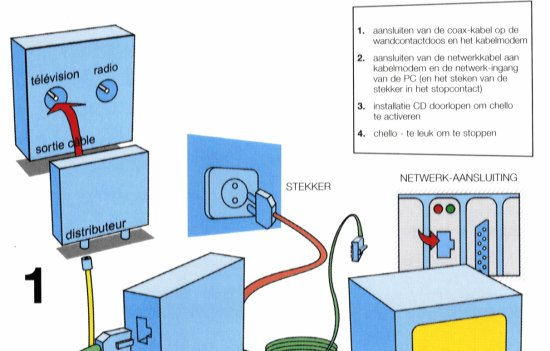

Depuis quelques semaines déjà, nous avons un abonnement internet par le câble. Il semblerait, si j'en crois les quelques remarques et anecdotes que l'on nous a raconté, que nous n'avons pas choisit l'opérateur qui a la meilleure réputation ([Chello](http://www.chello.nl/), l'internet par le câble selon [UPC](http://www.upc.nl/)) mais après quelques --jours-- semaines problématiques, nous arrivons à nous connecter sans encombre. Jusqu'à hier ou le modem a refusé de me fournir les réseaux qui me permettent de communiquer. Hier, c'est la journée où des ouvriers sont venu salir l'appartement sous prestexte de changer les fenêtres. Mais comme ces histoires de fenêtres ne sont pas terminées, je continue à vous parler d'UPC.

{.center}

C'est en rangeant quelques affaires que je suis retombé sur ce CD d'installation qui ne nous a jamais servi. En voyant les quelques mot en français, je m'interroge : Est ce qu'ils ont voulu m'aider à faire mes branchements en traduisant ces quelques mots ou bien est ce que le responsable du *Chello installatiepakket 8* a relu le bon à tirer le vendredi soir à 17h ? Connaissant la réputation de UPC, je penche plutôt pour la deuxième solution.
