Mes problèmes avec UPC et les fenêtres ne sont pas finis alors, une échapatoire : les souvenirs de [Koninginnedag](/koninginnedag) avec cette fois ci, une collection de chapeaux (*hoeden*) oranges :

<!-- HTML -->

<!-- / HTML -->
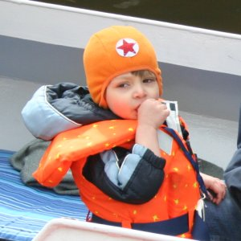  
Un petit aviateur soviet

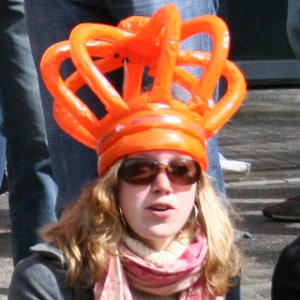  
La couronne classique
<!-- HTML -->

<!-- / HTML -->
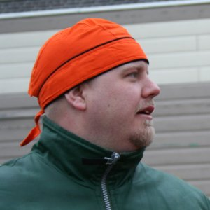  
Le foulard de pirate

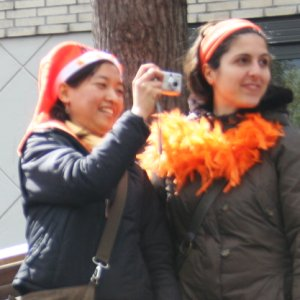  
Un bonnet de père noël
<!-- HTML -->

<!-- / HTML -->
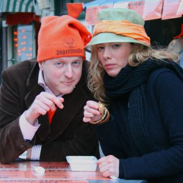  
Le meunier et la meunière | [Quel est son moulin à Amsterdam ?](/les-moulins-d-amsterdam)
<!-- HTML -->

<!-- / HTML -->
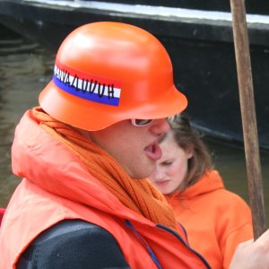  
Groupir 

<!-- HTML -->

<!-- / HTML -->
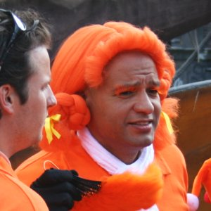  
L'année Mozart
<!-- HTML -->

<!-- / HTML -->
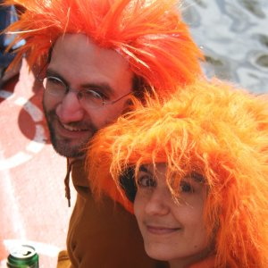  
Deux [belles tignasses](http://www.flickr.com/photos/13274211@N00/470975708/)
<!-- HTML -->

<!-- / HTML -->
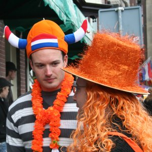  
Un viking et le magicien d'Oz

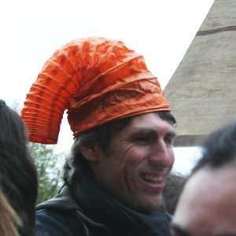  
Tuyau d'aération
<!-- HTML -->

<!-- / HTML -->
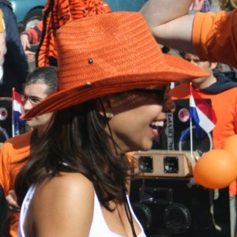  
Texas style
<!-- HTML -->

<!-- / HTML -->
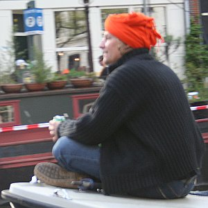  
Méditation enturbanée
<!-- HTML -->

<!-- / HTML -->
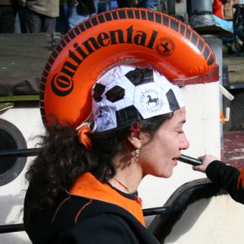  
Le chevalier Ajax avec un pneu
<!-- HTML -->

<!-- / HTML -->
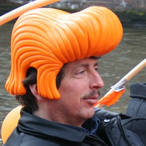  
Banane

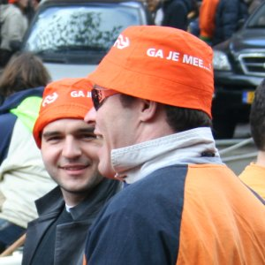  
Le bob de la NS

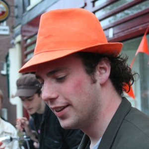  
Ska ou Indiana Jones
<!-- HTML -->

<!-- / HTML -->
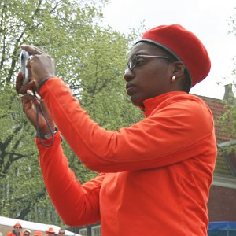  
Béret
<!-- HTML -->

<!-- / HTML -->
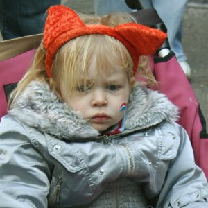  
Oreilles de chaton

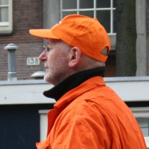  
Le mécano du PrinzenGracht

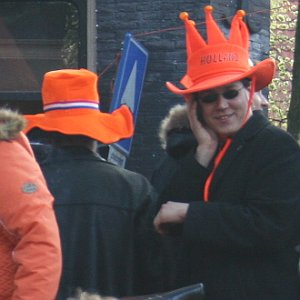  
Deux chapeaux en feutrine
<!-- HTML -->

<!-- / HTML -->
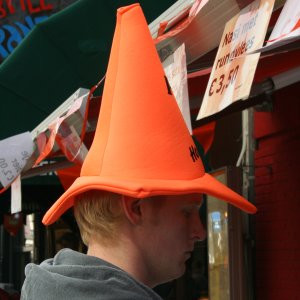  
Une sorcière
<!-- HTML -->

<!-- / HTML -->
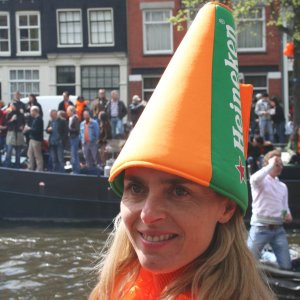  
Le porte-voix [pour annoncer la bière](http://www.xs4all.nl/~jlhkrans/Reine_2006/pages/DSCN1569.htm)
<!-- HTML -->

<!-- / HTML -->
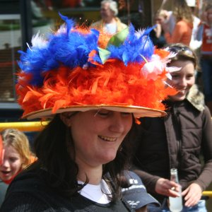  
les plumes aux couleurs Néerlandaises
<!-- HTML -->

<!-- / HTML -->
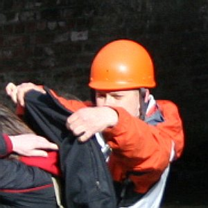   
Spéléo ou casque japonais ?
<!-- HTML -->

<!-- / HTML -->
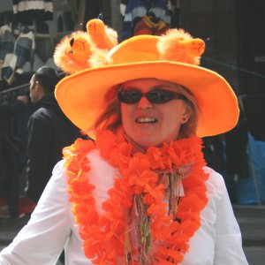  
La reine mère avec des lions
<!-- HTML -->

<!-- / HTML -->
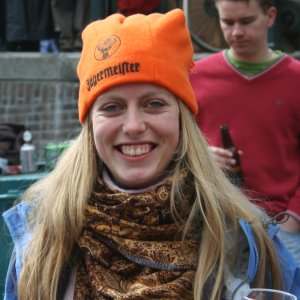  
Skieuse suisse

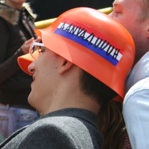  
Encore un soldat allemand
<!-- HTML -->

<!-- / HTML -->
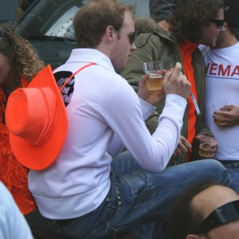  
Stetson sur le dos
<!-- HTML -->

<!-- / HTML -->
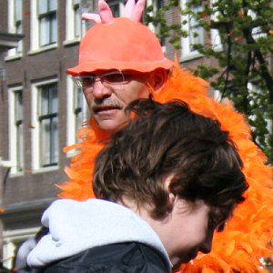  
Pis de vache
<!-- HTML -->

<!-- / HTML -->
  
Afro
<!-- HTML -->

<!-- / HTML -->
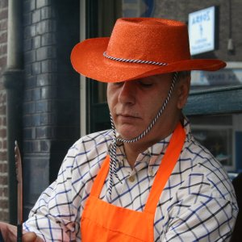  
Chapeau de paille
<!-- HTML -->

<!-- / HTML -->
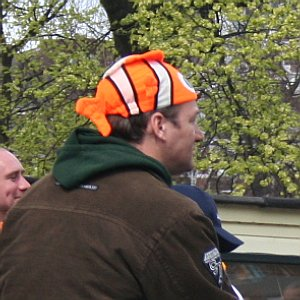  
Nemo, un poisson sur la tête
<!-- HTML -->

<!-- / HTML -->
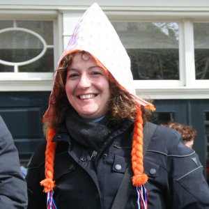  
La coiffe traditionelle
<!-- HTML -->

<!-- / HTML -->
  
Un melon c'est orange non 
<!-- HTML -->

<!-- / HTML -->
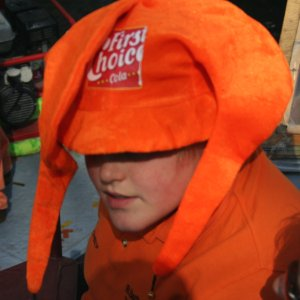  
Joker
<!-- HTML -->

<!-- / HTML -->
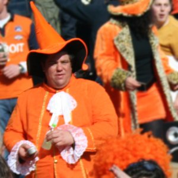  
Huguenot au chapeau pointu
<!-- HTML -->

<!-- / HTML -->
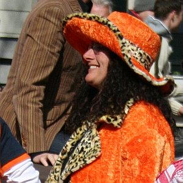  
Kitch léopard
<!-- HTML -->

<!-- / HTML -->
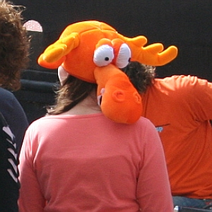  
Heu c'est quoi ça ?
<!-- HTML -->

<!-- / HTML -->
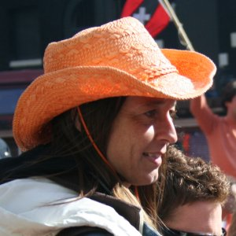  
Cow --boy-- girl

<!-- HTML -->

<!-- / HTML -->
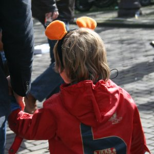  
Oreilles de Mickey

<!-- HTML -->

<!-- / HTML -->
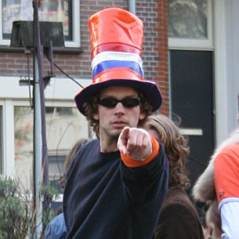  
You 
<!-- HTML -->

<!-- / HTML -->
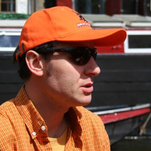  
Le Gentil Organisateur

<!-- HTML -->

<!-- / HTML -->
  
Chapeau huguenot avec poils
<!-- HTML -->

<!-- / HTML -->
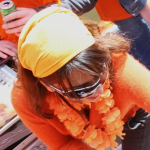  
Foulard sur la tête

<!-- HTML -->

<!-- / HTML -->
  
Avec des fleurs
<!-- HTML -->

<!-- / HTML -->
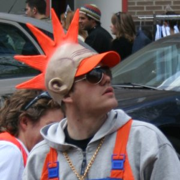  
Punk ou coq ?
<!-- HTML -->

<!-- / HTML -->
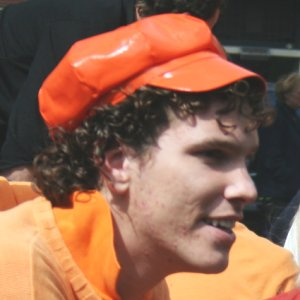  
Gavroche ou AC/DC ?

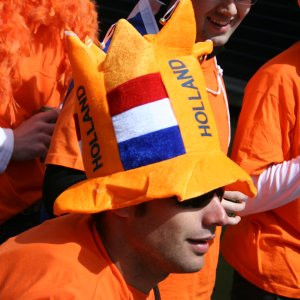  
loufoque et traditionnel
<!-- HTML -->

<!-- / HTML -->
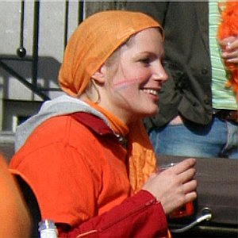  
Une étole sur la tête
<!-- HTML -->

<!-- / HTML -->
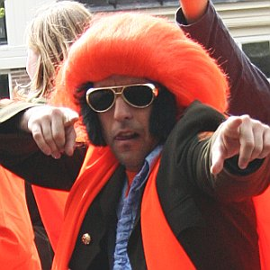  
Love me tender
<!-- HTML -->

<!-- / HTML -->
  
La Reine était là
<!-- HTML -->

<!-- / HTML -->
  
Couronne en carton
<!-- HTML -->

<!-- / HTML -->
  
Bonnet en laine
<!-- HTML -->

<!-- / HTML -->
  
Un cocker avec des lunettes

Autres billets sur le sujet :
* [Koninginnedag (la fête de la reine)](/koninginnedag)
* [Après koninginnedag](/apres-koninginnedag)
* [Quelques panoramiques](/pas-de-fete-du-travail)
* [La fête de quelle reine ?](/la-fete-de-quelle-reine)
* [Lettre aux copains qui viennent à la fête de la reine](/lettre-aux-copains-qui-viennent-a-la-fete-de-la-reine)
* [La fête de la reine sera mobile](/la-fete-de-la-reine-sera-mobile)
* [La fête de la reine, c'était bien mieux avant](/fete-dela-reine-bien-mieux-avant)
---