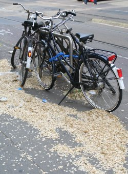

{.left}
Ces dernières semaines, le printemps avait fait une entrée en force dans le mois de mai au point de retrouver à Amsterdam les températures parmi les plus hautes d'Europe. Puis le vent marin s'est levé et la température est revenue à un niveau normal. Aujourd'hui il pleut.

Au printemps, beaucoup d'arbres perdent leur semences et comme Amsterdam est une ville verte et bercée par les vents, on le remarque à tous les coins de rues. Ça a commencé par une fine couche de polen que je retrouvais sur mon vélo tous les jours. maintenant ce sont d'innombrables confettis blancs qui jonchent le sol et sont soulevés par les raffales et tournoient à l'angle des rues comme des grains jettés à la gueule de mariés hilares. 

Je ne sais pas de quels arbres veinnent ces *confettis* mais il y en a partout dans la ville. Nottement dans mon quartier où les vélos semblent se garer sur un nid de neige. Ça n'a en tout cas rien à voir avec la neige du mois de juin que j'ai [photographié il y a 10 ans à Saint Petersbourg](http://web.archive.org/web/20091009172826/http://membres.lycos.fr/artic/stpet/neige.html). Là bas ce sont des semences des peupliers qui s'entassent dans les rues et comme ce n'est pas une matière ignifuge, les gamins jouent à y mettre le feu. Rien de tout cela ici.

* Photo d'[Amsterdam sous la vraie neige](/la-temperature-ressentie)
