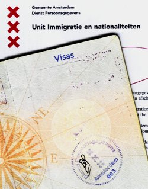

Je vous ai déjà dit que je m'étais [enregsitré aux impots](/sophie-pas-numero). Je me suis aussi enregistré à la mairie.

<!-- HTML -->

Les renseignements administratifs donnés dans cette page ne sont plus à jour. La nouvelle adresse du <b>Dienst Persoonsgegevens</b> dépend de votre adresse à Amsterdam, <a href="http://www.amsterdam.nl/@508070/pagina/">pour le centre c'est Amstel 1</a>. Dans l'hotel de ville. Les horaires d'ouverture sont indiqués.

<!-- / HTML -->

<!--excerpt-->

J'ai fait ça le jour de l'obtention de mon [SoFi nummer](/sophie-pas-numero). Je suis allé à une antenne spéciale de la mairie qui se chargeait de l'enregsitrement des étrangers.  
{.right}
**Gemeente Amsterdam Dienst Persoonsgegevens**   
**Unit Immigratie en nationaliteiten**   
Johan Huizingalaan 757 à Amsterdam (dans le bâtiment de la police des étrangers)  
tel :  020.551.9252 ([site web](http://www.amsterdam.nl/gemeente/diensten_bedrijven/dienst/over_de_dienst))  
Heures d'ouverture : lundi à vendredi de 08h30 à 15h30.  

## Tout dépend du fonctionnaire qu'on a en face

D'autres français se sont fait immatriculer aux services de la mairie à Stadhouderskade mais là bas, on a dit à Sophie que pour nous, ça se passait à  Johan Huizingalaan. J'y suis donc allé, on m'a tamponé mon passeport et demandé de revenir avec un acte de naissance. Sophie y est allé le lendemain, on lui a tamponé son passeport mais cette fois, sans rien lui demander. 

## Verdonk s'en mèle

Dans les deux cas on nous informait sur la nécessité de s'enregistrer à l'[IND](http://www.ind.nl/en/inbedrijf/actueel/RegistrationEU.asp), le ministère de l'intégration dont **Rita Verdonk** est la ministre ([j'avais bien dit que j'en reparlerais](/l-affaire-ayaan-hirsi-ali)). Cette obligation n'est en vigueur que depuis le 1er mai. Les services de la mairie nous ont remis une page explicative mais sont incapables ni de préciser ni de d'expliquer cette nouvelle mesure. Un numéro vert est à notre disposition pour plus de renseignements. Nous n'avons pas appelé.

Verdonk a une manière très sarkosienne de --montrer-- faire croire qu'elle décide les flux migratoires. Nous avons estimé que, puisque nous habitons aux Pays-Bas depuis une date antérieure, nous n'irons pas nous enregistrer à l'IND. Du moins pas tant qu'on ne nous demande pas de papier en ce sens.

## Est-ce bien légal ?

Je me demande d'ailleurs si cet enregistrement à l'IND ne va pas à l'encontre d'une nouvelle directive sensée [améliorer la libre circulation et du droit de séjour des citoyens de l'UE](http://europa.eu/rapid/pressReleasesAction.do?reference=IP/06/554&format=HTML&aged=0&language=FR&guiLanguage=fr). [7 millions de citoyens européens vivent déjà dans un autre État membre](http://europa.eu/rapid/pressReleasesAction.do?reference=MEMO/06/179&format=HTML&aged=0&language=FR&guiLanguage=fr).

----

## Nouveau mot: *allochtone*

A noter qu'aux Pays-Bas, on ne parle pas d'*immigré* mais d'*allochtone*. J'utiliserais ce dernier terme qui me semble plus exact.
