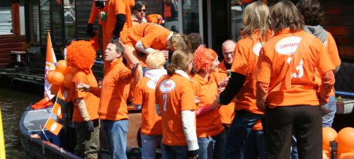

Pas de jour férié ici le 1er mai. Je vous rappelle qu'il y a 2 jours c'était férié et qu'il ne faut pas abuser. A la demande générale, quelques photos du [29 (Oranje) avril](/koninginnedag/).

Après les photos de [pendant](/koninginnedag) et [après](/apres-koninginnedag/) voici quelques panoramiques :

Autres billets sur le sujet :
* [Konninginnedag](/koninginnedag)
* [Après konninginnedag](/apres-koninginnedag)
* [Ma collection de chapeaux](/hoeden)

D'autres photos de notre sortie en bateau sont disponibles :  
* [sur le site de Pascale](http://www.xs4all.nl/~jlhkrans/Reine_2006/).
* [sur mon album en ligne](http://alix.guillard.fr/phototeque/view_album.php?set_albumName=konninginnedag-2006)
* Plus [une photo avec notre bateau](http://harple.com/family/photos/netherlands/steve-in-nederland/steve-in-nederland-Pages/Image30.html)
---