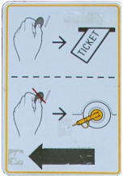

Le Park & Ride[^1] de [Olympisch Stadium](http://www.naaramsterdam.nl/live/main.asp?display_framework=garage&item_id=20&p_en_r=true) est facile d'accès de [notre nouvel appart'](/demenagement-en-photos) et propose soit deux tickets de Tram, soit... 2 VÉLOS!!!

## Address
**Olympisch Stadion 44  **
**Route (From A10)  **
**Take exit s108.  **

## Public Transport connections to the city centre
> 
> Trams 6, 16 and 24. Night bus 358
> Important: the P+R package does not include the costs of a night bus ticket. You will have to buy a ? 3.00 ticket from the driver.

Maximum 4 jours. Prix: 5,50? pour 24h.
**Les Trams 16 et 24 vont direct a la Maison[^2]**

Une fois garé dans le parking, il y a un bureau où il faut demander ses tickets de tram où ses vélos. Le ticket de parking est ainsi enregistré comme P+R avec l'heure d'arrivée. Les tickets de tram sont remis gratuitement pour deux personnes valables pour un aller **et** un retour en centre ville (voyage d'une heure maxi). On paye la totalité en revenant chercher la voiture.[^3]

{.left}

---
[^1]: **Park & Ride :** Déjà vu à Bruxelles où à Lille, ces parkings en périphérie des villes des Pays-Bas, vous permettent de garer votre voiture facilement puis de rejoindre le centre ville à bon prix grâce aux transports en commun à proximité. Le prix de parking est compris dans le ticket de transport. À Amsterdam, c'est plutôt recommandé d'utiliser les P+R parce que le stationnement dans le centre est **très** cher.
[^2]: Direction *Central Station* arrêt *Albert Cuypstraat*.
[^3]:  Vous trouverez beaucoup de renseignements sur les différents moyens de se garer à Amsterdam sur le site [Naar Amsterdam en anglais](http://naarad04.asp4all.nl/engels/index.htm)