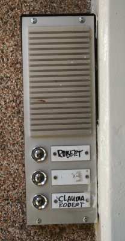

Robert a acheté un appartement dans *le Pijp*.

{.right} Robert a acheté un appartement dans le Pijp, l'appartement que nous louons aujourd'hui. Il a amménagé au 3e étage et Claudia habitait au premier. Tous les matins, en allant travailler, Robert croisait Claudia dans les escaliers.

Peut-être qu'un soir, en croisant Claudia, Robert l'a invité à visiter sa terrasse, peut-être que Claudia lui a proposé des tapas au coin de la rue. Peut-être qu'ils sont tous deux arrivés en retard à leur réunion annuelle de copropriétaires et qu'ils ont appris à se connaître là, devant une porte de syndic fermée.

Je ne sais pas comment ça s'est passé mais quelque temps plus tard, Robert a ajouté son nom a coté de celui de Claudia. Il a rangé son appartement et l'a mis en location. Claudia a accepté qu'il vienne vivre chez elle et grâce à ça, nous avons put louer l'appartement du troisième étage.

Aujourd'hui, pour venir nous rendre visite, il faut sonner à « Robert », « Robert tout seul ».
