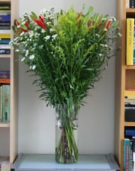

## Robert caille

L'histoire de [Robert et Claudia](/de-haak-crochet) n'est pas exacte. En fait, ce couple est propriétaire de l'immeuble entier. Je ne connais pas l'histoire qui a mis leurs noms sur deux sonettes de la maison. Lors de leur dernier déménagement du 27 avril dernier, ils allaient s'installer au bord de l'Amstel, laissant l'immeuble vide à part notre appart. ( ← quelle belle allitération ).

## Robert né
Robert nous avait prévenu que les fenêtres allaient êtres changées en deux jours et sans nous déranger. Vous savez déjà [ce qu'il en a été](/changer-quelques-fenetres) de ces deux jours. La semaine de pénibles travaux s'est achevée hier soir aussi mal qu'elle avait commencée. Un plombier prévu à 16h00 est arrivé à 19h00 pour reposer un radiateur démonté samedi dernier. Il est resté jusqu'à 22h30 pour termier son travail et j'ai donc raté un rendez-vous important. Je me suis engueulé avec son patron. Robert a eu droit à un message téléphonique dépité et un mail incendiaire.

{.right}
## Robert seuse
Ce matin, Robert est passé à la maison, alors que je portais des rideaux à la laverie et qu'une femme de ménage briquait l'étage. Robert a fait le tour de nos derniers griefs. Puis il est revenu avec un bouquet de fleurs. *Pour nous aider à nous sentir à nouveau chez nous*. ( J'avais déjà acheté des tulipes hier pour Sophie, j'ai l'air de quoi maintenant ? ). Je peux enfin débaler mes étagères achetées il y a une semaine pour pouvoir me sentir chez moi pour de bon. Voyez ci-contre les fleurs entourées de nos bouquins, ça a quand même une autre gueule qu'un [tas de briques](/changer-quelques-fenetres).
