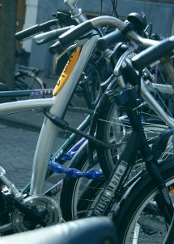
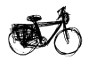
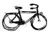

{.left}
Pour faire comme les Néerlandais, j'ai rammené mon vélo parisien à Amsterdam. Il m'a fallu plus d'une heure pour le démonter et le faire tenir dans la R5 à Paris et toujours une heure pour le sortir et le remonter à l'arrivée. Mais il est bien là. aujourd'hui garé entre deux «batavus».

Je ne suis pas le seul [B-twin](http://www.decathlon.fr/FR/Product_arborescence/Bikes_and_rolle/Bikes/city_and_countr/multi_purpose_b/product_6556056/index.html) à Amsterdam (j'en ai vu un autre chez un français) mais il n'y en a pas beaucoup d'autre. D'ailleurs il faut être bien stupide pour rouler en B-twin à Amsterdam, il y a bien des points où le vélo hollandais montrer sa supériorité face au B-twin.

* il a un chouette look et ila donc plus de chance de se faire voler
* il y a des freins qui s'usent alors que [les vélos](/?q=v%C3%A9los) hollandais utilisent le rétropédalage
* la chaine n'est pas protégée
* le dérailleur n'a pas l'air très solide
* que faire de 30 vitesses dans une ville plate ?
* le cadre est petit et il est difficile de l'attacher à un porte-vélos dans la rue
* mon pantalon est plein de camboui
* la selle grade l'eau quand il pleut

Je ne sais pas si ma liste est exhaustive. Je suis malgré tout ça, très content de pouvoir faire enfin du vélo à Amsterdam. Je ne regrette pas d'avoir rapporté mon B-twin de Paris.

Lire aussi [la révision du btwin](/revision-du-btwin) pour voir l'évolution de ce vélo.

et aussi :

<!-- HTML -->

<a href="/plein-de-velos-hollandais" title="tout savoir sur la bicyclette aux Pays-Bas">
<!-- / HTML -->
**Plein de vélos hollandais**  
{.center}  
1) Les avantages  
<!-- HTML -->
</a>

<!-- / HTML -->

<!-- HTML -->

<a href="/plein-de-velos" title="tout savoir sur la bicyclette aux Pays-Bas">
<!-- / HTML -->
**Plein de vélos hollandais**  
{.center}  
2) Les styles
<!-- HTML -->
</a>

<!-- / HTML -->

<!-- HTML -->

<a href="/plein-de-velos-hollandais-3" title="tout savoir sur la bicyclette aux Pays-Bas">
<!-- / HTML -->
**Plein de vélos hollandais**  
{.center}  
3) Les marques
<!-- HTML -->
</a>

<!-- / HTML -->

<!-- HTML -->

<a href="/plein-de-velos-pas-hollandais-4" title="tout savoir sur la bicyclette aux Pays-Bas">
<!-- / HTML -->
**Plein de vélos hollandais**  
{.center}  
4) Les marques étrangères
<!-- HTML -->
</a>

<!-- / HTML -->

<!-- HTML -->

<a href="/une-heure-sans-velo" title="tout savoir sur la bicyclette aux Pays-Bas">
<!-- / HTML -->
**Plein de vélos hollandais**  
{.center}  
5) Parking à vélos
<!-- HTML -->
</a>

<!-- / HTML -->

<!-- HTML -->

<a href="/les-velos-de-location" title="tout savoir sur la bicyclette aux Pays-Bas">
<!-- / HTML -->
**Plein de vélos hollandais**  
{.center}  
6) Vélos de location
<!-- HTML -->
</a>

<!-- / HTML -->

<!-- HTML -->

<!-- / HTML -->
---