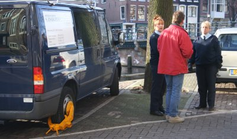
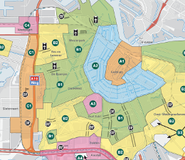

Une place libre en plein centre ville dans une rue calme et tranquille. Juste à l'ombre d'un arbre, on se croirait dans un village... Pas de signe d'interdiction et ça ne gène personne, une place rêvée à deux pas des coins à visiter. Le week end à Amsterdam commence super bien. Domage qu'il finisse aussi mal avec [un sabot sur la voiture](http://www.stadstoezicht.amsterdam.nl/live/index.jsp?nav=1964&loc=10880&det=1731).

{.center}

''Une  fois que le sabot est posé, il n'est pas très utile de vouloir parlementer''

Se garer coute cher à Amsterdam et c'est grâce à ça que ceux qui payent le prix peuvent encore trouver des places en centre-ville. **Le stationnement dans la rue est payant et très cher** . Il y a ça et là des bornes où il faut acheter son ticket de parking pour le temps prévu. tout dépassement est sanctionné et les excuses classiques (j'étais parti faire de la monnaie...) ne marchent pas. Vous êtes prévenus.

[{.left}|http://meinamsterdam.nl/files/data/2008-overzichtskaarten_stadstoez.png]
**Amsterdam est découpé en zones de stationnement**. Rester une heure en centre-ville coute entre 3,40 € et 4,40 €. En bas de chez nous, c'est 2,20 € et il faut bien calculer son temps parce que ça peut couter beaucoup plus... La moindre minute de dépassement alors qu'un agent de la ville (ou un agent privé de la société PCH) passe par là et vous êtes bon pour une amende de 49 à 95 euros. Vous noterez que tout n'est pas si contraignant, le stationnement est gratuit de minuit à 9 heures du mat'. Le jour de [la fête de la reine](/?q=koninginnedag), le stationnement est gratuit dans toute la ville.

Il y a aussi des parkings souterrains dans la ville mais les tarifs ne sont pas beaucoup plus avantageux (souvent plus de 3 € par heure). 

Je ne saurais trop vous conseiller de venir en centre-ville en transport en commun après [avoir laissé votre voiture dans un Park & Ride](/pour-ceux-qui-viennent-nous-voir-en-voiture).
---