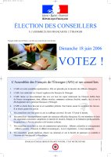

Les 155 membres de l'[Assemblée des Français de l'étranger](http://assemblee-afe.fr/index.php3) sont élus au suffrage universel direct pour 6 ans  par les Français inscrits sur les listes électorales consulaires.
Ils sont renouvelés par moitié [tous les 3 ans](http://assemblee-afe.fr/article.php3?id_article=53). Pour la première fois le vote par internet est possible et il commence aujourd'hui. Il fallait pour cela, s'inscrire avant le 2 mai puis confirmer son inscription entre le 30 mai et le 6 juin.

[{.left}| /public/images/scans/Affiche-AFE-18-juin-2006-600.jpg]
Le type de scrutin est variable en fonction de la circonscription. En allemagne, le scrutin est un scrutin de liste à la proportionnelle. Aux Pays-Bas (cicronscription d'Amsterdam), c'est un scrutin majoritaire à deux tours. Habituellement, dans ce genre d'élection, il y a deux candidats (un à gauche et un à droite) mais cette année, autre particularité des Pays-Bas, il y aura trois candidats : [Madame Bernadette Brigot épouse Van der Horst](http://www.bvanderhorst.nl/) ([ADFE](http://www.adfe.nl/)), [Madame Maryse Imbault épouse Meijer](http://www.afe2006.nl/) ([UFE](http://home.wanadoo.nl/ufe/)) et [Monsieur Tanguy le Breton](http://www.deblauweleeuw.nl/candidats.htm) (sans étiquette). Il y a 6 ans, le candidat de droite [l'emportait d'une courte majorité](http://home.att.net/~csfe/elections/2000/la_haye.htm). Mais cette année, le trublion non-alligné rend le scrutin moins binaire et rien n'est encore joué.

Les trois candidats ont été interviouvés il y a peu par [le forum des hollandais](/le-forum-des-hollandais) (en fait, c'est le forum des francophones en pays batave). [Maryse](http://www.leforum.nl/phpBB/viewtopic.php?t=4523), [Bernadette](http://www.leforum.nl/phpBB/viewtopic.php?t=4523) et [Tanguy](http://www.leforum.nl/phpBB/viewtopic.php?t=4525) (j'espère qu'ils me permettent de les appeler comme ça) se présentent...

Cette année, il y a 10727 inscrit sur les listes électorales pour la circonscription d'Amsterdam. Bien sûr Je vous --donnerais-- donne [les résultats](/resultat-des-elections).

Et inutile de me demander pour qui je vais voter, je suis encore inscrit à Paris.
---