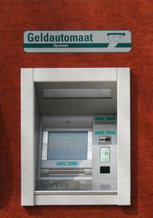
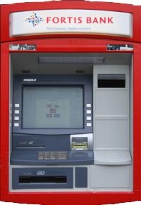
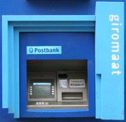
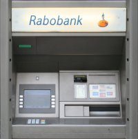
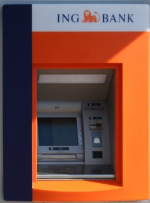

Pour mes réglements quotidiens et encaisser un jour mon salaire, il me faut ouvrir un compte en banque. Mais comment choisir une banque dans un nouveau pays alors que les commentaires de chacuns sont toujours subjectifs ? L'esthétique peut-être ?

Les principales banques de dépot aux Pays-Bas sont ABN-AMRO, ING, Rabobank, Postbank, SNS Bank et Fortis bank. Je peux faire un tour sur chque site web pour me faire une idée. ...

* [ABN-AMRO](http://www.abnamro.nl/nl/index.html) oui oui, c'est le groupe qui sponsorise l'Ajax et qui détient Banco Real au Brésil ([ABN AMRO rachetée](/les-petites-courses-de-l-ete) en 2007)
* [ING](http://www.ingbank.nl/inet/cmn/common/cmn_index.jsp?BV_UseBVCookie=no) en France on connait ING direct
* [Rabobank](http://www.rabobank.nl/particulieren/) l'association de RaiffenssenBank et Boerenleenbank
* [Postbank](http://www.postbank.nl/ing/pp/page/home/0,6493,1859_103763,00.html) La banque postale a été rachetée par ING mais garde sa spécificité
* [SNS Bank](http://www.snsbank.nl/) Impossible de trouver une agence à Amsterdam
* [Fortis bank](http://www.fortisbank.nl/fbnl/do/homeI.do) La banque d'Utrecht

Bon, ces sites web sont en neerlandais ce qui n'aide pas trop si on ne parle pas bien cette langue.

J'ai aussi essayé de regarder les distributeurs de billets. Pourquoi ne pas choisir ma banque en fonction de l'aspect de ses distributeurs de billets. On dirait qu'ici, certaines banques s'attachent à habiller leurs *Geldautomaat* de jolies couleurs. Voici quelques échantillons :

Ronce de noyer chez [ABN-AMRO](/abn-amro-banque)

Fortis s'habille de rouge

L'[ex banque étatique](/postbank-amsterdam) dont le bleu se voit de loin

Un logo bizare pour la banque coopérative

ING utilise le *oranje* national

Je suis toujours à la recherche d'**un distributeur SNS** mais impossible d'en trouver un à Amstedam

### Lire aussi :
 **[France / Pays bas: Comparatif des services bancaires](/france-pays-bas-comparatif-des-services-bancaires)**

 **[Le nouveau Rabo Scanner](/nouveau-Rabo-Scanner)**

 **[Une banque qui demande moins de sous](/une-banque-qui-demande-moins-de-sous)**

 **[La fin du porte monnaie électronique](/Porte-monnaie-electronique-la-fin-du-Chipknip)**

 **[Les sécurité des sites bancaires](/la-securite-des-sites-bancaires)**

 **[Attention, emprunter de l'argent coûte de l'argent](/emprunter-de-l-argent-coute-de-l-argent)**

 **[Changement de banque: Rabobank](/changement-de-banque-rabobank)**

 **[Postbank devient ING](/postbank-devient-ing-officielement)**