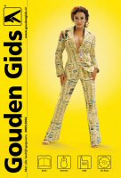

{.right} Depuis mercredi soir, la machine à laver était en panne. Il m'a donc fallu trouver un réparateur de machines à laver et pour celà, il y a les pages jaunes . Ici, les pages jaunes s'appellent *Gouden Gids* (le guide doré) et sont sisponibles sur le web. [goudengids.nl](http://www.goudengids.nl/) utilise même un logo qui ressemble fort au logo des *yellow pages* anglaises mais je n'accuserais personne de plagiat.

Je me suis laissé dire une fois que lorsqu'on faisait une recherche sur [goudengids.nl](http://www.goudengids.nl/), il fallait passer tout de suite à la deuxième page de résultats pour avoir une chance de trouver une réponse qui corresponde à la recherche. Ceci pour dire que le moteur de recherche de ce guide en or est vraiment mauvais. Après vérification, je conforme que les résultats de la première page n'ont jamais rapport avec ce que l'on recherche mais c'est rarement mieux sur la deuxième page.

## Nouveau mot: *Wasmachine*

J'ai donc cherché mon réparateur sur le Gouden Gids papier qui est par contre très bien. Il y a un index en anglais. J'ai ainsi appris que *Washing machines and washer driers - maintainance and repairs* me conduisait à *Wasmachine and Wasdrogers onderhoud and reparatie* ce qui doit vouloir dire la même chose dans deux langues germaniques. Le réparateur est arrivé hier. 20 minutes et 189 euros plus tard, la pompe à eau de la machine était changée et je peux donc faire une machine ce matin.

<!-- post notes:
http://www.robertpennekamp.nl/katjaschuurman.html 
http://krizzz.nl/img/050720-covergroot.jpg 
http://www.goudengids.nl/static05/images/katja_station.gif 
Katja Schuurman
--->
