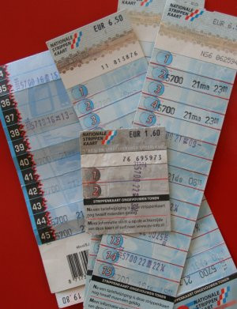

<!-- HTML -->

Les renseignements donnés dans cette page ne sont plus à jour. Les regles dans les transports d'Amsterdam ont changé en 2009 et l'<b><i>ov-chipkaart</i></b> remplace la <b><i>Strippenkaart</i></b>. <a href="/la-ov-chipkaart">voir mon nouveau billet</a>.

<!-- / HTML -->

Pour réduire le nombre de voitures dans les villes, il faut appliquer [une politique répressive](/a-amsterdam-se-garer-coute-cher) certes, mais il faut aussi encourager le [parking en périphérie](/pour-ceux-qui-viennent-nous-voir-en-voiture) et surtout mettre à disposition un réseau de transports publics efficaces.

Je ne sais pas si les transports sont plus efficaces ques d'autres, il me semble que le réseau de trams est dense et que leur passage est régulier. Mais  il y a sans conteste un avantage que l'on ne retrouve pas dans les autres pays, c'est la strippenkaart. Ce bout de carton est un titre de transport. Il est divisé en bandes (*strippen*) qu'il faut composter à chaque début de voyage. Cette bande validée est ainsi valable une heure quelque soit le nombre de changement. Le gros avantage de cette strippenkaart est sa validité nationnale. Tous les transports publics du pays l'accèptent avec le barème de leur choix. Un coté pratique pour les voyageurs qui tournent beaucoup dans le pays. cela fait 25 ans que ça existe et je ne connais pas d'autre pays qui ait encore repris cette idée géniale.

{.left}
## Barème de la strippenkaart

Amsterdam est découpé en plusieurs zones. Chaque zone traversée coûte une *strip* en plus d'une première *strip* de prise en charge. Ainsi, si l'on voyage dans une seule et seule et même zone, il en coûte deux *strippen* tandis qu'un voyage de la zone 2 à la zone 2 qui passe par la zone 1, traverse deux zones et coûte donc trois *strippen*. Chaque validation est valable une heure même si l'on change de [tram](/le-tram-en-panne), de bus ou de métro. En fait, c'est plus simple à comprendre qu'à expliquer.

Les zones ne sont pas indiquées partout, le plus simple en tram est d'indiquer sa destination au chauffeur qui validera la *strippenkaart* en concéquence.

Autre avantage, la *strippenkaart* n'est pas nomimnative et il est donc possible de voyager à plusieurs avec la même *kaart* à condition bien sûr de valider la *kaarte* autant de fois qu'il y a de voyageurs.

* Voir aussi: [Ma carte pas orange](/ma-carte-pas-orange)

Le prix des Strippenkaart est disponible [sur les site web des transports municipaux](http://www.gvb.nl/REIZIGERS/KAARTJEKOPEN/Pages/Strippenkaart.aspx).