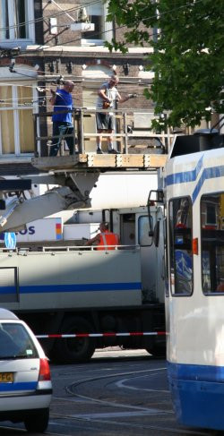

Parfois les trams tombent en panne. Ils s'arrêtent parce qu'ils n'ont plus de courant pour les tirer (Bien sûr, ce n'est pas le courant mais le moteur électrique qui tire le tram). Dans ce cas, il faut réparer les caténaires ou le pantographe pour que le tram puisse à nouveau y puiser l'éléctricité dont il a besoin.

{.center}

C'est rare de voir la rue bloquée pour ce genre de problème et c'est ce qui est arrivé dimanche dernier. Je vous laisse donc avec cette photo ensoleillée, quoi que j'ai bien aussi [celle là](/public/images/photos/2006-06/travaux-catenaire-tram-ferdinand-bol.jpg).
---