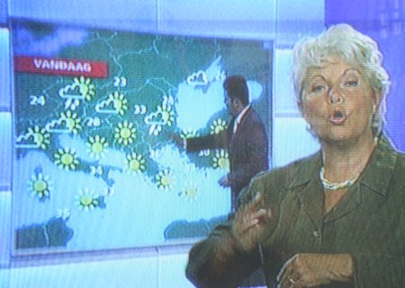

Le matin sur la 2e chaine, il y a les nouvelles en continu. Un journal de cinq minutes passe en boucle et me permet de comprendre un peu mieux le Néerlandais après la ènième répétition de chaque titre. 

**Ce journal télé se termine avec la météo** comme partout dans le monde. Seulement voilà, depuis quelques semaines, la météo dure un peu plus longtemps. Les Pays-Bas sont informés du temps qu'il fera le jour même, dans l'ensemble de l'Europe.

{.center}

On ne fait pas plus voyageurs que les Neerlandais. Ils sont nombreux à partir sur les côtes du sud de l'Europe dès que le temps est favorable. Ceux qui restent au pays sont, quant à eux, au courant de ce que leurs compatriotes vacanciers subissent.