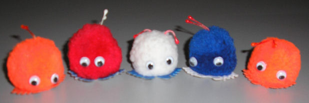

[Albert Hein](/albert-hein-et-compagnie) est le plus grand distributeur du pays et c'est lui qui m'aide à cuisiner le [lapin-garou à l'hydromel](/le-lapin-cochon-avec-appeltjes). Mais quand ce dernier se décide de soutenir l'équipe nationnale, c'est autrement qu'en prêtant des maillots pour l'entrainement...

Autre [opération marketing](/la-hollande-pour-la-france) de la coupe du monde de foot (alias *WK 2006*) est [le wuppie](http://magliery.com/Graphics/wups/). Un wuppie est une boule de poils acryliques colorés à coller partout pour montrer qu'on aime bien le orange. Il y a même [un clip vidéo](http://www.ah.nl/wup/article.jsp) pour donner des idées de ce qu'on peut en faire. Beaucoup de Albert H. étaient en rupture de stock.

<!-- HTML -->

{.center}
Les wuppies sont même sur <a href="https://commons.wikimedia.org/wiki/File:Wk_wuppies.JPG">sur wikipedia</a>

<!-- / HTML -->

<!--excerpt-->

Maintenant que l'équipe des Pays-Bas est rentrée à la maison, le wuppie a moins la cote (encore qu'[il se vend encore bien sur eBay](http://search.ebay.nl/wuppie-wuppies_W0QQfkrZ1QQfromZR8QQsatitleZQ28wuppieQ2cwuppiesQ29)...). Une idée serait de garder les bleus les blancs et les rouges pour soutenir une équipe ce soir... Pour les oranges, il faut attendre la [fête de la reine](/koninginnedag) l'année prochaine...

voir aussi **[Albert Hein Bonuskaart](/les-semaines-du-hamster)** et [On schtroumpf bien les smurfs|]

<!-- post notes:
http://www.youtube.com/watch?v=R21LvR8uTUc
--->
