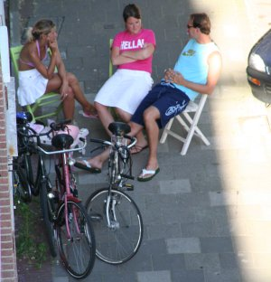
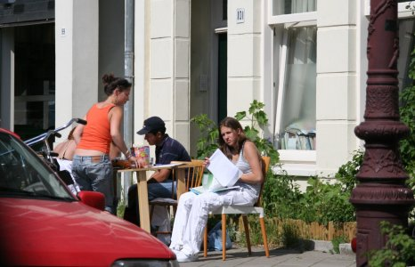

{.right}
Le soleil n'est pas à proprement parler une spécialité Néerlandaise, c'est le moins qu'on puisse dire. Il y a pourtant des jours de beau temps comme partout ailleurs en Europe. Mais les Néerlandais, sûrement peu habitués à ce que cela dure, profitent de la moindre éclaircie pour **vivre dehors**. 

Les terrasses des cafés font le plein certes mais les habitants aussi amménagent leur terrasse sur le trottoir, qui pour déjeuner, qui pour bronzer, qui pour regarder le foot ou lire un bouquin...

Dans cette réimplantation généralisée en plein air, les étudiants en profitent pour réviser.

{.center}

voir aussi : 
* [Prendre le soleil (autre solution)](/prendre-le-soleil-autre-solution)
* [Travailler au soleil](/travailler-au-soleil)
