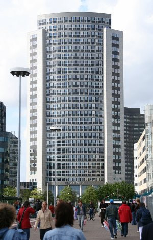

La semaine dernière je suis retourné à Sloterdijk, un de ces n?uds urbains qui entourent la ville. À NS Station Sloterdijk, on peut prendre le train pour aller à Haarlem, Schiphol ou La Haye sans passer par le centre. Il y a aussi une station de métro et des terminus de trams et de bus. le Ring (autautoute A10) qui passe à coté peut vous conduire jusqu'à [un Park and Ride](/a-amsterdam-se-garer-coute-cher) proche de cette gare.
Autour de ce lieu, les tours de bureaux ont poussé et c'est dans l'une d'elle que je suis déjà [allé chercher mon SoFi nummer](/sophie-pas-numero). 

## La Crystal Tower

Cette fois, j'ai eu droit de monter au 24e étage de la [Crystal Tower](http://www.kfn.nl/fullscreen_locatie.php?style=blue&locatie_id=89&taal=1&template=0&bezochte_locatie_id=11354) d'où la vue est magnifique. Helaas je n'ai pas pris de photo parce que j'étais en entretien. Le vous montre donc cette tour vue de l'extérieur.

{.center}

Voici donc cette tour, l'une des plus grande du coin et de la métropole amstelodamoise : 20.373 m² de bureaux dans une tour de 95 m de haut. Elle a été achevé en 2002 et est l'?uvre de [AGS Architekten & Planners](http://www.ags.nl/projects/projects_NL.asp?ID=6). Elle abrite des entreprises comme Deloite et Kelkoo mais ce n'est pas eux que je suis allé voir...