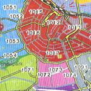

{.left}

**Les codes postaux amstelodamois** ont, comme partout, une réalité géographique. Les quatre premiers chiffres indiquent une zone et les deux lettres qui suivent indiquent la rue dans cette zone. La plupart des administrations ont cette base de donnée postale dans leurs ordinateurs et la simple question du code postal de résidence donne déjà beaucoup de renseignements.

Quand quelqu'un donne son adresse, si on ne connait pas la rue mais qu'on a la carte des codes postaux en main, on peut savoir dans quel quartier il habite et ainsi trouver la rue plus facilement... Voici, dévoilée ici, la carte des codes postaux d'Amsterdam, piquée dans un journal d'annonces immobilières.

[{.center}|/public/images/scans/cartes/amsterdam-postcode-800.png]  
<!-- HTML -->

<b>Carte des codes postaux d'Amsterdam</b> 
<b><i>Amsterdam postcodekaart</i></b>

<!-- / HTML -->
---