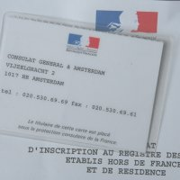

Mon passeport n'est pas périmé mais j'ai du le faire refaire parce que la photo se décollait et les douaniers avaient pris pour habitude de la décoller encore plus pour voir si ce n'était pas un faux.

Le Consulat de, c'est la mairie des Français à l'étranger[^1]. Alors, pour demander un nouveau passeport, je suis allé là bas. J'ai de la chance, [le Consulat général de France](http://www.consulfrance-amsterdam.org/) est à dix minutes de la maison à vélo.

{.left}
Je ne m'était pas encore fait immatriculer en tant que français établi à l'étranger. Ils en ont donc profités pour m'immatriculer et m'inscrire dans le registre des français qui habitent aux Pays-Bas. J'ai même eu la possibilité de m'inscrire sur les listes électorales[^2]. En échange de tout ça, la gentille fonctionnaire m'a remis une carte qui ne doit pas servir à grand chose. Dessus, il y a écrit *Le titulaire de cette carte est placé sous la protection consulaire de la France*. Je ne sais pas trop ce que ça veut dire mais c'est rassurant de se savoir protégé.

## Un nouveau passeport gratuit
J'ai fait faire un nouveau passeport (avec la puce) et -après insistance- je n'ai pas été soumis au droit de timbre. Le truc ? J'avais déjà fait changer l'adresse sur mon passeport en arrivant à Paris. Il n'y avait plus de place et j'ai simplement fait une demande pour y indiquer maintenant ma nouvelle adresse à Amsterdam. Seuls les changement d'adresse et l'ajout d'enfant ne sont pas soumis au droit de timbre. Par contre, la date de validité du nouveau passeport reste la même que sur l'ancien titre. Ce truc peut être utile pour ceux qui doivent demander un nouveau passeport à puce[^3].

* voir aussi : [Mes premiers pas comme immigré](/mes-premiers-pas-comme-immigre)
---
[^1]: Tous les services d'état civil, d'inscriptions sur les listes électorales et tout ça, peuvent être faites là bas.
[^2]: J'ai préféré avoir la possibilité de m'exprimer aux prochaines municipales en 2008
[^3]: Les anciens passeports (non optiques) et ceux délivrés après le 26 octobre 2005 et ne possédant pas la puce obligent leur titulaires à faire une demande de visa pour aller aux États-Unis. [La faute à qui ?|http://pangloss.blog.lemonde.fr/pangloss/2006/03/raffarinades_ga.html]...