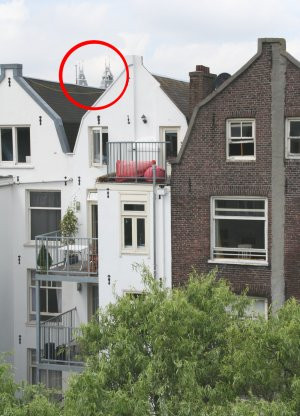

Notre appartement est quand même admirablement placé. Non seulement il m'offre une situation proche du cœur de la ville[^1], mais en plus, de notre chambre, il y a **une vue imprenable sur l'un des plus prestigieux musées du monde**.

En gros, je suis content de vous apprendre qu'on voit [le Rijksmuseum](https://fr.wikipedia.org/wiki/Rijksmuseum_Amsterdam) depuis notre chambre à coucher. 

Enfin, quand je dis «chambre à coucher» c'est en fait qu'il y a un petit balcon qui donne sur notre chambre et si l'on va sur ce balcon, on peut voir le Rijksmuseum. 

Enfin, quand je dis «voir» il faut se tenir debout et essayer de viser entre les « frontons arrières » des maisons d'en face. En tout cas, on voit le *Rijksmuseum* de la maison, et ça, c'est pas donné à tout le monde... Voici la preuve en photo :

{.center}

Le Rijksmuseum c'est quand même le Louvre local, le plus grand musée de la ville et même s'il est toujours en travaux, il y a toujours une queue interminable de touristes attendant des heures pour pouvoir regarder *la ronde de nuit* de Rembrandt.
---
[^1]: ce qui me permet de vous en faire découvrir un peu régulièrement