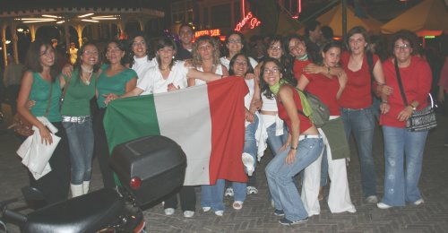

A force d'aller [à mon consulat](/carte-inutile), de faire des [sorties bateau](/sortie-en-bateau) et de [regarder les matchs de foot](/on-est-en-finaale) avec des compatriotes et de lire des [blogs francophones](/kreukreuscopie) on va finir par croire que les seuls étranger qui vivent à Amsterdam sont des français. Il n'en est rien.

Pour preuve, ce groupe d'italiennes croisées dimanche dernier à [Rembrandtplein](http://www.amsterdam.info/fr/visite/rembrandtplein/). Elles avaient l'air d'être joyeuses.

{.center}
