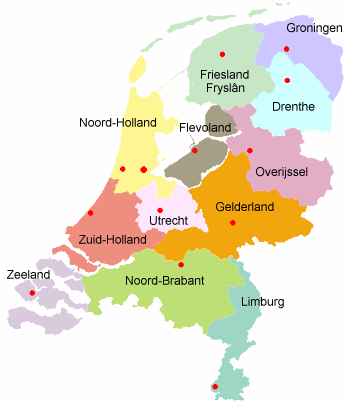

Aujourd'hui le tour fait étape aux Pays-Bas. Il ne faut pas dire que le tour passe en Hollande puisque c'est en Limbourg que le tour va passer.

{.right}

## La Hollande est une région, pas un pays
La Hollande est seulement une partie des Pays-Bas, C'est la région qui regroupe la Hollande du sud et la Hollande du Nord, les deux provinces les plus peuplées du pays. Même si les Néerlandais eux même font aussi souvent l'amalgame entre les deux, quelqu'un de rigoureux devrait parler de Néerlandais pour parler des habitants des Pays-Bas $$Durant la période des Provinces-Unies, la Hollande était le moteur économique du pays. C'est la raison pour laquelle son appellation par le nom d'une de ses provinces les plus importantes persiste. Il y a d'autres exemples de métonymie connus en Géographie, Le fait d'appeller le Royaume-Uni «Angleterre» ou de réduire l'Amérique aux États-Unis sont des classiques. Les habitants de Finlande ou de Malaisie sont aussi parfois réduits à leur composante principale...$$. 

## Les 12 régions
Pour connaitre en détail les 12 régions des Pays-Bas, vous pouvez vous rendre sur la page [ad hoc de wikipedia](http://fr.wikipedia.org/wiki/Provinces_des_Pays-Bas). Ce découpage administratif ne vient pas du hasard, l'histoire en a tracé les contours. Ainsi, les Provinces-Unies, (nom des Pays-Bas qui se sont affranchis de la tutelle espagnole) regroupaient les comtés de Hollande et de Zélande, les Seigneurries d'Utrecht, de Groningue, de Frise et le duché de Gueldre. D'autres provinces où villes se sont associées aux Provinces Unies au cours de l'histoire. Au 18e siècle, la domination française transforme ces territoires en départements de la République Batave. Quelques noms changent et les frontières se précisent. La Hollande du Sud devient par exemple le département des Bouches de la Meuse. A la chute de Napoléon, quand le 
Royaume-Uni des Pays-Bas retrouve sa souveraineté et rebaptise ses provinces de noms plus bataves.

### La partition du Limbourg
Mais très vite les Belges se soulèvent et demandent leur indépendance et un roi. Après la partition, le Limbourg est Belge. Mais une partie de ses habitants préfèrent rester sous tutelle des Pays-Bas et une partition du Limbourg est donc décidée avec pour frontière la Meuse, sauf à Maastricht qui reste --Hollandaise-- Néerlandaise et à Fourons qui reste Belge, petit bout de Flandre enclavé entre la province de Liège (Wallonie) et le Limbourg Néerlandais. Il y a donc deux provinces de Limbourg en Europe, l'une Belge et l'autre Néerlandaise. C'est dans cette province, la plus haute des Pays-Bas que le tour de France va s'arrêter aujourd'hui.

### La douzième province
Le Flévoland est la 12e province des Pays-Bas. Cette province n'éxistait pas avant sa création en 1968. Avant, c'était la mer, et aujourd'hui, c'est la province des Pays-Bas dont les habitants comme les habitations sont les plus jeunes. Cette province a été crée en gagnant des territoires sur la mer grâce à la construction de **la** digue de fermeture (*Afsluitdijk*). La digue a été terminée dans les années trentes mais la création des polders a pris des années et c'est en 1968 que la province a été effectivement crée.