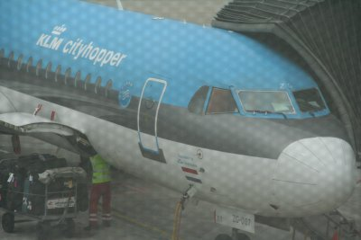
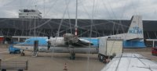

Je profite d'un voyage retour à Amsterdam pour vous parler d'une aventutre industrielle Néerlandaise...

Pour revenir à Amsterdam, KLM m'a fait voyager dans un de ses cityhopper, ces avions qui font des sauts de puce d'une ville à l'autre. La plupart de ces **KLM-cityhopper** sont des Fokker, le mien était un **Fokker F70**, 80 passagers sur des rangées de 5 sièges (deux à gauche et trois à droite). Un bel avion avec des moteurs Rolls-Royce situés à l'arrière de l'appareil et fabriqué dans le pays de la compagnie affrêteuse.

{.center}

**Anthony Fokker** est un des grand ingénieurs des débuts de l'aviation. Il est Néerlandais mais il a construit son permier avion en Allemagne. Il est ensuite devenu célèbre en construisant les fameux triplans allemands de la guerre 14-18. Après le traité de Versailles, comme l'Allemagne n'a plus le droit de construire d'avions, il rentre aux Pays-Bas et crée la société Fokker en se focalisant sur la construction d'avions civils. Les Fokker sont entrés dans l'histoire par leur utilisation dans de nombreuses **premières liaisons intercontinentales**. Cette aventure a continué jusque dans les années 80 à 90 avec la production d'avions commerciaux réputés comme les F-27, F-28, F50, F70 et F100. 

{.left}
Alors que l'entreprise a déposé son bilan en 1996, on trouve encore de nombreux exemplaires encore en service aujourd'hui sur l'aéroport de **Schiphol** et ailleurs. Nous allons encore pouvoir apprécier les hublots parfaitement ovales de ces avions pendant longtemps.

### Lire aussi   
* [Pas hier, pas en Fokker](/pas-hier-pas-en-fokker)
* [Un voyage avec Transavia](/un-voyage-avec-transavia)
* [Les avions de la KLM ont tous des petits noms](/voyage-klm-retour)
* [Les Vliegtuigspotters de Schiphol](/vliegtuigspotters)
---