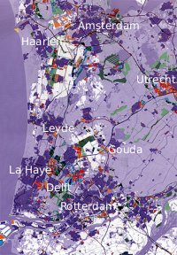

Peut-être que je vous parlerais de l'agence de travail temporaire un jour mais je vais présenter ici un exemple de conurbation particulier. La grande agglomération néerlandaise qu'on appelle **Randstad**.

En France, la plupart des grandes villes sont les points centraux d'une agglomération plus importante. Le meilleur exemple est Paris (2 millions d'habitants) au centre d'une agglomération de presque **10 millions d'habitants**. La commune la plus peuplée de la région parisienne est Boulogne-Billancourt dont tout le monde se fout et qui pourtant avec plus de 113.085 habitants$$Voir la [liste des communes de France par population](https://fr.wikipedia.org/wiki/Liste_des_communes_de_France_les_plus_peupl%C3%A9es) sur Wikipedia$$, est aussi peuplée que Nancy ou Rouen. Mais Nancy et Rouen sont au centre d'agglomérations bien plus peuplées qui font de ces villes des centres bien plus attractifs que Boulogne-Billancourt.

## Une conurbation

[{.left}|http://www.nai.nl/regie_e/new/rand1_e.html]
On retrouve ce modèle d'agglomération dans le monde entier. **Amsterdam** et ses 700 000 habitants est aussi entouré de quelques villes (**Amstelveen**, **Diemen**, **Haarlemmermeer**, **Zaanstad**...) qui en font une agglomération. Mais la proximité d'autres pôles (**Utrecht**, **Almere**, **Haarlem** et plus au sud **La Haye**, **Rotterdam**...) dilue beaucoup le pouvoir d'attraction de la capitale. Toutes ces agglomérations se touchent ou sont reliés par d'autres villes (**Gouda**, **Delft**, **Hilversum**, **Leyde**...) qui en font une seule et grande agglomération urbaine mais sans véritable centre : [La Randstad](http://www.regio-randstad.nl/index_eng.php). En Europe, je crois qu'il n'y a que **la Ruhr** qui correspond à ce modèle qu'on appelle **conurbation**. (les néerlandais disent *conurbatie*)

## De Groen hart
Le centre de la Randstad, -et c'est là sa spécificité- est vert, peu peuplé et campagnard. On appelle ce centre [le Cœur Vert](http://www.vvvhetgroenehart.nl/) (*Groen Hart*) du Randstad.

Pendant le siècle d'or, la Hollande était la province la plus riche des provinces unies. Le commerce maritime a favorisé le dévoloppement des ports comme Amsterdam sur la Zuidersee et Rotterdam le long de la Meuse. Les autres villes de la province étaient florissantes aussi (La Haye, Haarlem, Utrecht...) grâce à l'essort du commerce ( certaines villes ont encore aujourd'hui des spécialitées connues  comme Delft et Gouda ). au XXe siècle, le développement urbain autour de pôles économiques comme Schiphol où administratif comme La Haye a achevé la conurbation. 

Aujourd'hui, **le Randstad compte plus de 7 millions d'habitants** (dont moi), ce qui fait **presque la moitié de la population des Pays-Bas**. C'est dire son importance.