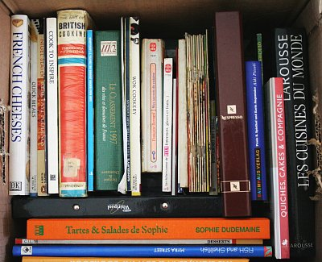
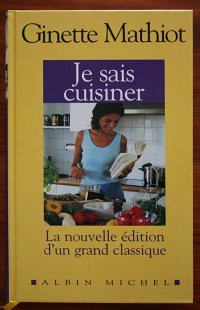

De notre déménagement, il reste un seul carton à vider. Il traîne dans la cuisine. Mais en fait il est bien là où il est.

Ce carton, c'est le carton des livres de cuisine, il n'est pas interessant de mettre ça dans le salon parce que ce n'est pas disponible quand on veut cuisiner recette. Il n'est pas possible de les ranger mieux dans la cuisine parce qu'il y a déjà des casseroles dans les placards.

  

{.center}
Les livres de cuisine de Sophie
  

  

{.center}
Le livre que Alix s'est fait offrir un jour
  

<!--excerpt-->

Aujourd'hui, nous avons mis en commun nos ouvrages sur la cuisine dans le même carton. Le déséquilibre que l'on peut constater entre l'apport de la fille et l'apport du garçon ne reflète pas la répartition des tâches dans la cuisine (heureusement).

