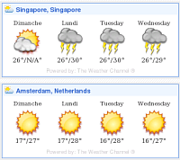

{.left}
Aujourd'hui, je pars en vacances pour trois semaines. Ce sera surement difficile de me connecter et encore plus compliqué d'écrire des articles ici. Je pourrais profiter de cette occasion pour vous écrire un long article sur les hollandais et les vacances, industrie très développée ici mais il est peut être plus amène de vous souhaiter à tous trois bonnes semaines d'été (vacances où non).

Et comme pour vous accompagner dans ces trois semaines (sinon ce souhait ne serais pas vraiment un souhait), Je vous promets quelques nouveaux articles sur les Pays-Bas. J'ai confié la tenue de ce blog à Hervé, le meilleur posteur de commentaire sur ce blog et le plus néerlandofan que je connaisse. Il va éditer quelques marbres[^1] que j'ai préparé et peut être vous faire découvrir des choses que je ne connais pas. Bonnes semaines d'été.
---
[^1]: **Marbre :** C'est un article que j'ai déjà écrit il y a un moment mais qui n'a pas encore été publié.