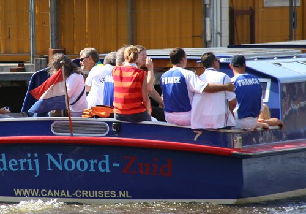
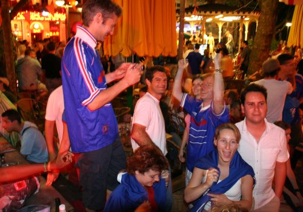

Pour la coupe du monde de football, beaucoup de néerlandais [ont fait des paris](http://annevickycarlier.blogspot.com/2006/06/wk-coupe-du-monde.html) dans leur entreprise ou entre amis. Même ceux qui ne sont pas passionés par le foot se prennent au jeu et suivent la coupe du monde. Les Pays-Bas ont été éliminés par le Portugal en 16e mais ils continuent à regarder les matchs, d'autant que le spectacle est au rendez-vous (enfin pas toujours$$des fois je me demande si gagner par pénalty ou [aux tirs aux buts](http://www.menteur.com/chronik/060705.html) est vraiment mérité...$$ mais bon).

À Amsterdam, il y a tellement d'étrangers qu'il y a forcément une communauté qui va se regroupper quelque part pour regarder le match avec *son* équipe. Dans mon quartier, il y a déjà eu des fêtes portugaises et italiennes à la fin de certains matchs... Les français ne sont pas en reste, ils ont plusieurs lieux de rendez-vous dans la ville$$moi je vais au Coco outbacks, sur Rembrandtplein mais il y a [d'autres lieux de rendez-vous](http://www.leforum.nl/phpBB/viewtopic.php?p=63204#63204).$$. Les touristes et les expats s'y retrouvent pour crier «allez les bleus# » en français dans le texte. Pour la finale, il faudra trouver autre chose, les bleus, ce seront les italiens...

{.center}

{.center}