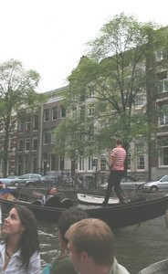

[Dimanche, j'ai pris l'avion](/hier-en-fokker) et lundi, j'ai pris le bateau. Non pas pour me déplacer mais pour faire le tour de la ville le temps d'une sympatique soirée.

J'ai pris des photos mais j'ai vraiment très mal réglé mon appareil et je n'ose pas montrer mes floues et mes bouchées alors que c'était si simple de prendre des photos en automatique... Bon il y a quand même quelques images que je vais vous montrer malgré la mauvaise qualité.

<!--excerpt-->

   Ces gens là étaient confortablement installés pour manger sous les derniers rayons du soleil.   [Les amstelodamois sortent dès qu'il y a un peu de soleil](/revisions-sous-le-soleil)...  

   Nous étions moins bien installés mais tout de même en bonne compagnie.

   Ça mitraille !

 Insolite : une gondole à Amsterdam

   C'est l'occasion pour prendre des photos dans les quartiers rouges sans se faire gronder...

   Quelques précisions historiques sur la ville

 Débarquement, c'est déjà fini

J'ai vraiment beaucoup aimé cette sortie. Ce tour en bateau m'a fait découvrir un autre angle sur des endroits que j'avais déjà apprécié ; mais surtout, j'ai découvert plein d'endroits que je ne connaissais pas du tout. Bedankt Michiel!
