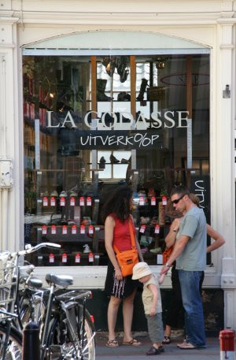

{.left}

## De la visite
Un petit bout de la famille est venu profiter du week end et c'est pour ça qu'il n'y a pas eu de billet ces derniers jours. Samedi leur voiture était garée [sous le stade olympique](/pour-ceux-qui-viennent-nous-voir-en-voiture).

Comme il y avait du soleil au menu, nous en avons profité pour faire un tour en ville et découvrir le centre. Beaucoup d'Amstelodamois étaient aussi de sortie dans les rues commercantes pour les soldes et sur les canaux avec leur bateaux et leurs coups de soleils.

## Le match du jour.
[Le match Brésil-France](http://www.nos.nl/gfx/nosstudiosport/wk2006/i_nieuws.html?leftiframe=http://www.nos.nl/nosstudiosport/artikelen/2006/7/1/01072300brafra.html&rightiframe=http://www.nos.nl/nosstudiosport/wk2006/artikelen/overzicht.html) était plus passionnant que le match Portugal-England mais comme les journalistes de *Nederland <2>* n'avaient apparement pas prévu de sujet de secours (en cas de victoire de la France). Le rendez-vous sportif de l'après match (*[Studio Sport](http://www.nos.nl/nosstudiosport/voorpagina/index.html)*) ne nous a montré que des images de Zidane (le sujet postume pour son départ à la retraite) et des images d'archives avec Johan Cruyff et Van Basten...

## Dimanche tranquille
Après mangé, toute la petite famille est partie et nous sommes allez au Vondelpark pour une sieste bien méritée au soleil. Cette sieste était rythmée par l'[Amsterdam's anual hiphop dance battle](http://www.flickr.com/photos/bandido/tags/breakz/) dont vous pouvez voir quelques photos ici : [Amsterdam's anual hiphop dance battle](http://www.flickr.com/photos/bandido/tags/breakz/).