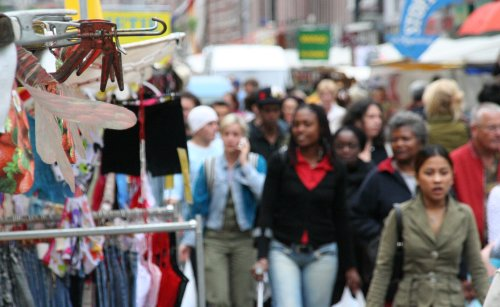
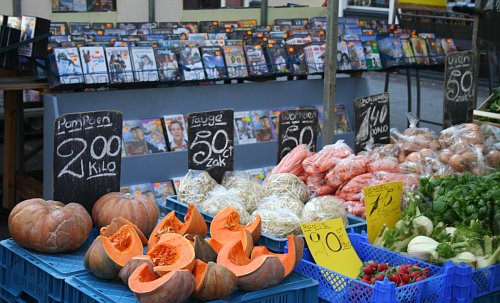
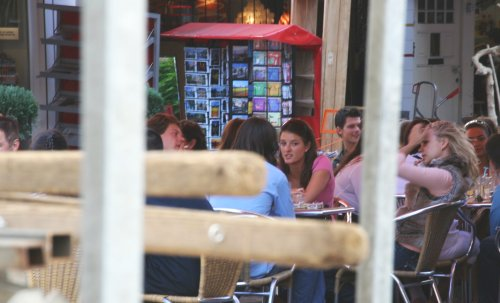

Le marché le plus proche de chez moi est aussi le marché quotidien le plus grand des Pays-Bas.

Ce marché est populaire et animé. On y vend de tout et aussi de n'importe quoi. Pour ma part, j'y vais pour la [viande](/le-lapin-cochon-avec-appeltjes)[^1], le poisson et les légumes mais on peut y trouver aussi [des briquets de mauvais goût](/briquets-aline)[^2] et des sacs d'arabe[^3], ainsi que des [tee-shirts de foot](/on-est-en-finaale), du fromage[^4] des chaussettes sexy et des tissus au metre, des épices, du hareng frais[^5] et des meubles. 

Beaucoup de monde achalende ce marché, spécialement les jours de beau temps... Les habitants du quartier, autochtones et allochtones de toutes origines[^6] d'abbord, parce que c'est le marché d'en bas de chez eux. Des étudiants y passent souvent leurs après-midis aussi parce que ce n'est peut être pas loin de chez eux et aussi parce qu'il y a pas mal de cafés sympas et pas cher dans les rues adjacentes. Les touristes enfin, viennent parce qu'ils ont lu dans leur guide que c'était un marché à visiter. Deux trois stands de souvenirs sont là juste pour eux. Enfin, en fin de journée les hérons [du Sarphatipark](/photos-du-pic-nic) viennent faire un tour pour voir si les poisonniers n'ont rien laissé pour eux.

Voici maintenant quelques photos de ce marché prises cet été, quand il faisait beau.
<!-- HTML -->

{.center}
La foule bigarée passe nonchalante devant les dessous sexys

{.center}
Ici on vend des fruits et légumes et aussi des DVD

{.center}
Un pot en terrasse juste à coté des étales
<!-- HTML -->

<!-- / HTML -->

---
[^1]: pour les filles qui aiment (Sophie se reconnaîtra)...
[^2]: pour les filles qui aiment (Aline se reconnaîtra)...
[^3]: pour les filles qui aiment (Marjo se reconnaîtra)...
[^4]: pour les filles qui aiment (Susannah se reconnaîtra)...
[^5]: Ici on dit [Hollandse Nieuwe Haring](/de-hollandse-nieuwe-haring)
[^6]: Je ne suis pas le seul allochtone européen à acheter mes légumes là ou ils sont les plus frais...