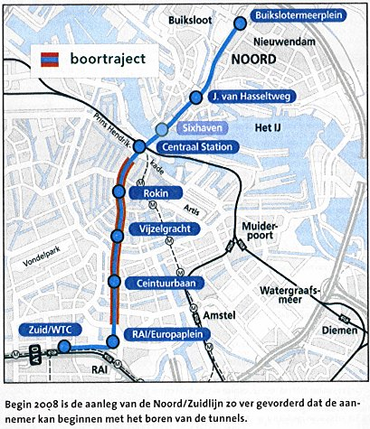

Amsterdam est une ville toujours en travaux. Je n'ai pas connu une seule journée sans croiser de déviation. Il faut dire que j'habite près de la future ligne de métro Noord / Zuid.

Cette ligne est souvent annoncée pour l'année prochaine depuis plusieurs années maintenant. La mairie distribue souvent des prospectus à son sujet parce que certaines rues barrées s'ouvrent, pendant que d'autres se fer,ent ou changent de sens. Les piétons doivent changer de trottoir et [les vélos](/tag/velo/) sont priés de passer ailleurs. 

Il y a des travaux à chaque future station du centre ville. À voir le nombre de personnes qui longent les travaux, génées par le bruit, l'ouverture de cette ligne semble très attendue. Ce devrait être dès son ouverture la ligne la plus utilisée. Dans beaucoup de cas elle évitera aux gens du nord de la ville de prendre le ferry pour aller au centre-ville. De plus, elle reliera la gare centrale au quartier d'affaires WTC par le chemin le plus direct. Toutes les stations du centre (Central Station, Rokin, Vijzelgracht) seront des stations d'interêt pour les touristes tout comme [Centuurbaan Station](/noord-zuidlijn-ceintuurbaan-station) qui sera au bord du [marché Albert Cuyp](/albert-cuyp-le-marche).

Dans un ancien numéro de son journal, la mairie nous donnait un plan de la ville avec la future ligne. Ça fait rêver. C'est ce qui motive mon article ici.

{.center}

Contrairement à ce qui est annoncé sur le journal, l'ouverture de la ligne n'est pas prévue pour 2008 mais elle a été plusieurs fois reportée et on nous promet aujourd'hui une mise en service pour 2013.

[Un site web](http://www.noordzuidlijn.amsterdam.nl/) ainsi qu'[un bureau d'informations](http://www.noordzuidlijn.amsterdam.nl/live/main.asp?display_framework=startpagina&item_id=23&selected_balkitem_id=472&parent_balkitem_id=459&level_id=2) donnent aussi des renseignements sur cette ligne nord-sud (*Noord/Zuidlijn*).

# Voir aussi
* [Noord-zuidlijn : Ceintuurbaan station](/noord-zuidlijn-ceintuurbaan-station)
* [Les maisons d'Amsterdam s'enfoncent](/les-maisons-s-enfoncent)
* Vous pouvez voir quelques images des travaux en passant [Noël sur Ferdinand Bolstraat](/noel-sur-ferdinand-bolstraat)...
