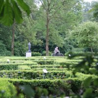
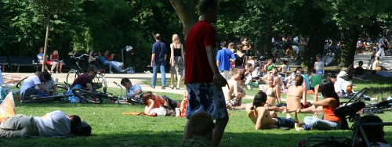

[{.left}|http://flickr.com/photos/13274211@N00/220282761/]
Parmi les lieux préférés des Amstelodamois pour [prendre le soleil](/revisions-sous-le-soleil), il y a **le Vondelpark**. Un rectangle de **49 hectares de verdure** en plein centre ville (enfin, plutôt au sud du centre ville). L'entrée principale donne sur la Leizeplein mais il y a des entrées tout autour du parc, donnant sur des grands axes où de minuscules impasses. Ce parc dispose de pelouses, de bois touffus, de lacs et de petits cours d'eau que des passerelles enjambent. On y retrouve aussi des cafés, des terrains de tennis et même **le musée du cinéma** dont la programmation est à surveiller. 

## Un peu d'histoire
Le parc a une histoire. Elle a commencé en 1864 quand un groupe d'Amstelodamois achetèrent 8 Ha de terrain pour y ouvrir un parc ouvert au public. Zocher fut chargé de l'amménager en *style anglais* et le parc ouvrit finalement en 1865 et commença à être très prisé pour les promenades à cheval. En 1867, on y érrigea une statue du poète **Joost van den Vondel**. C'est ce dernier qui donne aujourd'hui son nom au parc qui s'est agrandit jusqu'à atteindre la taille actuelle de 49 hectares.

## Plein d'histoires
À chaque rayon de soleil le parc est pris d'assault par les habitants et les touristes. Les habitants, y viennent pour lire, bronzer ou pic-niquer avec des amis. Chacun se pose sur son metre-carré vital avec ses provisions ou des affaires, des bobos avec une glacière, des jeunes avec une radio, des mamans avec les couches du bambin. Les vélos vont et viennent dans tous les sens en doublant les joggeurs du dimanche. Parfois les kiosques sont utilisés pour des concerts ou des radio-crochets. Bref, c'est un endroit blindé dès qu'il fait beau mais on y retourne parce qu'on y passe des bons moments.

{.center}
---