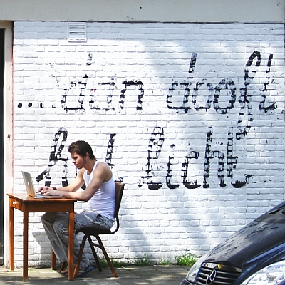

Je vous ai déjà présenté [des étudiants qui révisaient](/revisions-sous-le-soleil) dans la rue et des bobos qui prenaient l'apéro sur le trottoir. 

Dès qu'il fait beau, il faut profiter des rayons du soleil. Ici, nous avons un ibookiste qui (fait croire qu'il) travaille. La photo a été prise début mai et on peut voir à la tenue du gars que les Néerlandais n'ont pas froid aux bras$$Oui, à Amsterdam en mai, il peut faire très froid.$$.

{.center}

voir aussi : 
* [Prendre le soleil (autre solution)](/prendre-le-soleil-autre-solution)
* [Révisions sous le soleil](/revisions-sous-le-soleil)

voir aussi [mon nouveau boulot](/de-mon-boulot).