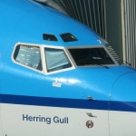

Me voilà de retour de vacances avec plein de pain sur la planche. Je ne vais donc pas faire un long billet. Juste un petit mot pour remercier publiquement Hervé d'avoir assuré l'intérim pendant ces trois semaines alors que lui, avait du boulot jusque là (geste).

## Les avions de la KLM ont tous des petits noms

Les vacances se sont bien déroulées merci et mon voyage retour s'est bien passé. C'était de nuit, dans un Boeing 747-400 de la [compagnie KLM déjà citée](/hier-en-fokker). Le petit nom de cet avion était « **City of Beijing** » alors que celui du voyage aller s'appellait « **City of Orlando** ». 

Les avions de la *Koninklijke Luchtvaart Maatschappij* ont tous des petits noms (à part les KLM Cityhopper et sans doute aussi les cargos) et c'est assez rigolo de les découvrir quand on arpente les couloirs de l'aéroport de Schiphol. Apparemment les 747 de la compagnie portent des noms de grandes villes alors que les autres modèles portent des noms d'oiseau ou de personnes (à ne pas confondre). 

Dans les exemples en photo ci-dessous, trois Boeing 737 avec les noms de deux explorateurs et d'une exploratrice.

<!-- HTML -->
<table align=center cellpadding=3><tr><td align=center>
<!-- / HTML -->
[|http://www.flickr.com/photos/13274211@N00/210053288/]   
**Roald Amunsdsen**  
[agrandir](http://www.flickr.com/photos/13274211@N00/210053288/)
<!-- HTML -->
</td><td align=center>
<!-- / HTML -->
[|http://www.flickr.com/photos/13274211@N00/210176345/]   
**Herring gull**  
[agrandir](http://www.flickr.com/photos/13274211@N00/210176345/)
<!-- HTML -->
</td><td align=center>
<!-- / HTML -->
[|http://www.flickr.com/photos/13274211@N00/210176344/]  
**Sir Henry M. Stanley**  
[agrandir](http://www.flickr.com/photos/13274211@N00/210176344/)
<!-- HTML -->
</td></tr></table>
<!-- / HTML -->

<!-- HTML -->

<h4 style="margin:0.5em 0 0 0;">Schiphol</h4>
<ul style="margin:0 0 1em">
<li><a href="/schiphol-l-aeroport-de-la-terreur">Schiphol, l'aéroport de la terreur</a>
<li><a href="/vliegtuigspotters">Les Vliegtuigspotters de Schiphol</a>
<li><a href="/un-voyage-avec-transavia">Un voyage avec Transavia</a>
<li><a href="Dernier-Fokker/">Le dernier Fokker des Pays bas</a> - <a href="/pas-hier-pas-en-fokker">Pas hier, pas en Fokker</a>
<li><a href="/schiphol-hall-M-metamorphose">Schiphol, Hall M comme Metamorphose</a>
</ul>

<!-- / HTML -->
---