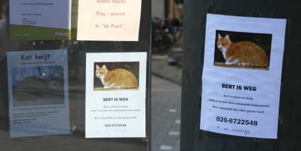

{.center}

On recherche Bert le chat, c'est [Elsekramer](http://flickr.com/photos/elsekramer/) qui m'a aidé à traduire ce message avec [sa photo sur flickr](http://flickr.com/photos/elsekramer/241286032/). Les affiches de recherche de Bert le chat sont placardées partout dans mon quartier, même devant le magasin [Albert Hein](/albert-hein-et-compagnie) où la viande n'est pas toujours si bonne que ça...

Un jour, en regardant par la fenêtre, j'ai vu Bert. Il se prélassait doucettement sur une chaise de jardin comme aiment le faire les Amstelodamois [les jours de soleil](/prendre-le-soleil-autre-solution). Je l'ai appelé et je lui ai dit qu'on le cherchait. Mais ce dernier a préféré m'ignorer en se lêchant la pate gauche. Peut-être sait-il qu'il est recherché par tout Amsterdam et peut-être a-t-il juste décidé de ne pas rentrer et de ne jamais répondre au sollicitations. Peut-être aussi que ce n'était pas Bert.

{.center}

***Missing: Bert*** 

*Bert is skittish and scared, especially in the to him unknown outside world*

*Please call if you have seen Bert*

***Bert est perdu*** 

''Bert est espiègle et peureux, spécialement dans le monde de dehors qu'il ne connait pas*

*Merci d'appeller si vous avez vu Bert''