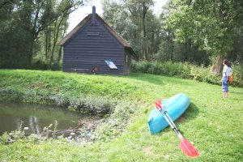

{.left}
Notre premier week-end après [les vacances](/les-vacances), nous sommes allés à [Biesbosch](http://www.biesbosch.org/), un des parcs nationaux des Pays-Bas. D'après ce que nous en avions lu, nous devions croiser plein d'oiseaux sauvages lors de notre balade en canoë mais nous n'avons vu que quelques grenouilles et des canards. La balade était quand même très agréable et nous avons pu arrêter notre embarcation à la **maison de bois** (*Houten griendwerkerskeet*) peu après avoir passé la **maison de pierre** (*Steren griendwerkerskeet*) et juste avant la **maison de paille** (*Rest steren griendwerkerskeet*). Nous n'avons pas croisé le grand méchand loup...

Biesbosch est situé à l'embouchure de la Meuse (*Maas*) au sud de la ville de Dordrecht (*Zuid Holland*). Les terres étaient auparavant immergées, habitées et cultivées. En 1492, survinrent les [inondations de Sainte Elisabeth](http://fr.wikipedia.org/wiki/Inondation_de_Sainte_Elizabeth) (*Sint Elisabethsvloed*). Par un gros orage de novembre, les digues qui protégeaient le polder cédèrent et la région fut submergée. Depuis lors, cette région est toujours une région aquatique, c'est même l'un des derniers endroits d'Europe avec une marée d'eau douce. La région a quand même été bien aménagée au XXe siècle. Un jeu de Polders, digues et caneaux protège les terres les plus basses d'une éventuelle nouvelle inondation.
---
<!-- post notes:
http://sophie.fodil.co.uk/fruit/normal/500/img_6034-Biesbosch.jpg
--->
