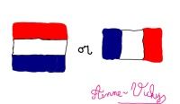

J'aurais pu vous raconter que je retournais de chez maman qui habite en Creuse et que je rentrais chez moi qui habite aux Pays-Bas. Ce n'est pas de moi dont je vais vous parler mais d'une compatriote qui vis aux Pays-Bas et qui as ouvert un blog. Décidément, la blogosphère franco-batave est riche !

{.right}
Le [blog d'Anne-Vickie](http://annevickycarlier.blogspot.com/index.html) est donc une suite de billets anecdotiques, [comme je fais parfois](/Dagelijks), qui racontent souvent des habitudes méconnues des Néerlandais (dernièrement [au sujet des anniversaires](http://annevickycarlier.blogspot.com/2006/08/verjaardag-van-maxim-lanniversaire-de.html)). Le gros plus de ce blog est qu'il est rigoureusement bilingue (pas comme moi) et qu'en plus de la découverte du pays, on peut travailler sa langue. Bref, ceux qui sont habitués de «*me in amsterdam*» ont tout interrêt à suivre aussi «[entre Pays-Bas et Creuse](http://annevickycarlier.blogspot.com/index.html)».
---