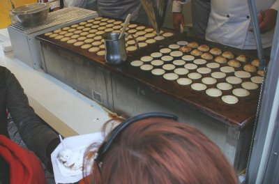

J'ai découvert ça à [koninginnedag](/koninginnedag). Ce sont de petites galettes patissières et sucrées que j'ai mangé recouvertes de sucre glace. C'est la véritable spécialité de crèpe nationnale et comme toujours il y a des endroits ou c'est meilleur que d'autre. Les poffertjes à la chantilly de [Keukenhof](/les-derniers-jours-de-keukenhof) sont paraît-il très bonnes mais je n'ai pas pu les goûter.

{.center}

Il semblerait que la saison chaude ne soit pas la saison des poffertjes. Mais c'est quand même la saison des fraises et un dessert avec poffertjes, fraises et chantilly, c'est exquis !

*La photo ci dessus vous montre la préparation des poffertjes dans les camions ambulants*