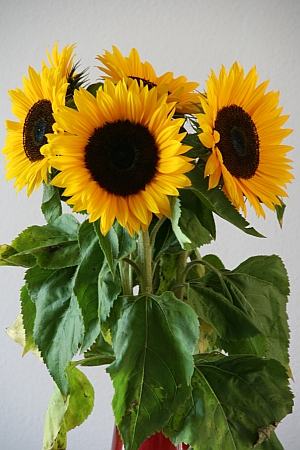

Je suis au pays de Van Gogh et chez le premier producteur mondial de fleurs coupées. 

En cette fin d'été, les fleurs de saison, ce sont les tournesols ('[zonnebloem](http://www.zonnebloem.nl/index.cfm)''). Alors évidement, j'en ai acheté un petit bouquet pour décorer la maison.

{.center}

## Nouveau mot : Zonnebloem

Tournesol donc...