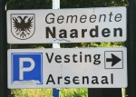
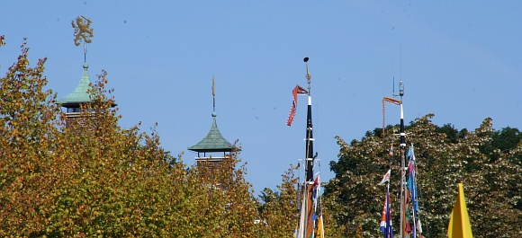
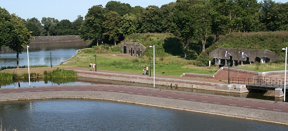

Que peut-on faire un dimanche après-midi où le soleil nous propose un air à 24°C ?

hein ?# que peut-on faire putain de narden ?!

{.left}Nous sommes allés à Naarden justement et c'était très bien. [Naarden](http://www.naarden-cultureel.nl/index.html) est une ville [fortifiée en étoile](http://en.wikipedia.org/wiki/Image:Naarden_kl.JPG) (façon Vauban) dont les remparts sont quasiment intacts. Une fois arrivés et garés sur un parking des remparts, on peut découvrir les remparts couverts de verdure et se promener sur les chemins qui serpentent en haut et en bas de ces murailles, on peut visiter la vieille ville, se poser en terrasse, aller au musée ou visiter l'*arsenaal*. 

{.center}

{.center}

Nous avons préféré [bronzer dans l'herbe](http://sophie.fodil.co.uk/fruit/land/500/img_6590-Naarden.jpg) et [boire des coups](http://sophie.fodil.co.uk/fruit/normal/500/IMG_1127-Wien.JPG) parce qu'il n'y a qu'à Naarden qu'ils nous est offert de le faire en si bonne condition.

{.center}
---
<!-- post notes:
http://www.fotofestival.com/
--->
