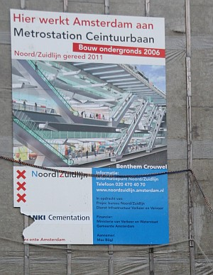

Sur le [marché Albert Cuyp](/albert-cuyp-le-marche), on est quelque peu gèné par les gros travaux qui ont lieu sur la rue Ferdinand Bol, juste à l'entrée du marché. Il s'aggit des travaux pour la construction d'une futur station de [la ligne de métro Nord-Sud](/la-ligne-du-nord-au-sud) dont je vous ai déjà parlé. À l'angle entre ces deux rues, est accroché une pancarte qui nous annonce ce que sera cet endroit à l'avenir.

{.center}

Cette pancarte indique que la ligne devrait ouvrir en 2011 mais [la mairie vient d'annoncer](http://www.noordzuidlijn.amsterdam.nl/live/main.asp?name=nieuws&item_id=NL_AMS_IVV_100000000351) il y a peu que l'ouverture de cette ligne allait être repoussée en 2013 et que la facture serait plus élevée de quelques 83 millions d'euros... À suivre...

* La suite: [Les maisons d'Amsterdam s'enfoncent](/les-maisons-s-enfoncent)
* La suite de la suite [Des travaux qui n'en finissent toujours pas](/travaux-n-en-finissent-toujours-pas) ou l'on apprends que les travaux sont repoussés à 2015.

Vous pouvez voir quelques images des travaux en passant [Noël sur Ferdinand Bolstraat](/noel-sur-ferdinand-bolstraat)...
